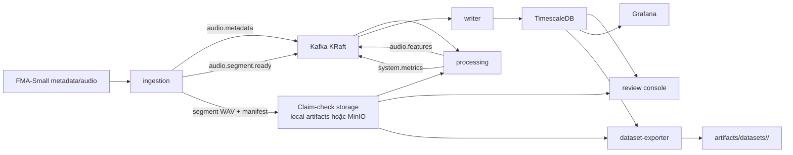

# event-driven-audio-analytics

`event-driven-audio-analytics` là hệ thống nghiên cứu giới hạn cho bài toán phân tích âm thanh FMA-Small gần thời gian thực bằng kiến trúc event-driven microservices. Hệ thống dùng Kafka để truyền các sự kiện nhỏ, dùng cơ chế claim-check để lưu audio artifact ở filesystem cục bộ hoặc MinIO/S3-compatible storage, dùng TimescaleDB làm nguồn dữ liệu đã ghi nhận, cung cấp review console để kiểm tra run/track/segment, dùng Grafana để đối chiếu quan sát vận hành, và xuất ra các gói dataset/analytics có thể tái sử dụng.

## Định Hướng Đề Tài

Đề tài: **"Nghiên cứu kiến trúc Event-Driven Microservices và Xây dựng hệ thống phân tích dữ liệu lớn âm thanh thời gian thực trên nền tảng Private Cloud"**.

Repository này hiện thực hóa đề tài trong phạm vi có kiểm soát:

- Dataset: chỉ dùng **FMA-Small**.
- Kiến trúc: `ingestion -> processing -> writer -> review/Grafana -> dataset-exporter`.
- Runtime mặc định: Docker Compose.
- Biến thể private cloud: K3s một node, có Kafka, TimescaleDB, MinIO, Grafana và các service chính.
- Bằng chứng đánh giá: demo deterministic, smoke test, MinIO claim-check, restart/replay, K3s manifest validation, latency/throughput/resource/scaling evidence.

Đây là hệ thống nghiên cứu và demo có giới hạn. Repository không tuyên bố production-ready, không benchmark-scale, không high availability, không training/model serving, và không mở rộng sang dataset khác ngoài FMA-Small.

## Giá Trị Chính

- Minh họa tách rời microservices bằng Kafka topic và event contract `v1`.
- Giữ Kafka làm small-event transport, không đẩy waveform hoặc tensor lớn lên broker.
- Dùng claim-check URI để tham chiếu segment WAV và manifest: `/artifacts/...` hoặc `s3://<bucket>/...`.
- Chuẩn hóa audio về mono 32 kHz, chia segment 3.0 giây, overlap 1.5 giây.
- Tính RMS, silence flag, log-mel shape summary và Welford-style operational metrics.
- Ghi dữ liệu idempotent vào TimescaleDB theo event envelope và checkpoint.
- Cung cấp review console đọc-only làm giao diện kiểm tra chính.
- Dùng Grafana làm lớp quan sát bổ trợ trên cùng dữ liệu TimescaleDB.
- Xuất dataset bundle từ dữ liệu đã ghi nhận, gồm accepted/rejected tracks, accepted/rejected segments, split Parquet, normalization stats và dataset card.
- Có luồng chứng minh restart/replay cho cùng `run_id`.
- Có biến thể MinIO và K3s để thể hiện hướng triển khai private-cloud có giới hạn.

## Kiến Trúc Tổng Quan



### Luồng dữ liệu chính

1. `ingestion` đọc metadata/audio FMA-Small, validate track, chuẩn hóa audio, chia segment, ghi segment WAV và manifest vào claim-check storage.
2. `ingestion` publish `audio.metadata`, `audio.segment.ready` và metric vận hành lên Kafka.
3. `processing` consume `audio.segment.ready`, đọc artifact qua URI, kiểm tra checksum, tính feature summary, publish `audio.features` và metric.
4. `writer` consume `audio.metadata`, `audio.features`, `system.metrics`, ghi TimescaleDB và checkpoint để hỗ trợ replay/idempotency.
5. `review` đọc TimescaleDB và claim-check artifact để hiển thị run/track/segment/media theo chế độ read-only.
6. `Grafana` đọc các view TimescaleDB đã provision sẵn để đối chiếu chất lượng audio và sức khỏe hệ thống.
7. `dataset-exporter` đọc dữ liệu đã ghi nhận và artifact metadata để tạo dataset/analytics bundle.

## Thành Phần Runtime

| Thành phần | Vai trò |
|---|---|
| `kafka` | Kafka KRaft một broker, truyền sự kiện nhỏ giữa services. |
| `timescaledb` | Lưu metadata, feature summary, system metrics, checkpoint và các view phục vụ review/dashboard. |
| `minio` | Backend S3-compatible tùy chọn cho claim-check artifact. |
| `minio-init` | Tạo bucket MinIO khi chạy biến thể MinIO. |
| `ingestion` | Đọc FMA-Small, validate, segment, ghi artifact, publish event. |
| `processing` | Đọc segment artifact, verify checksum, trích xuất summary, publish feature event. |
| `writer` | Ghi event vào TimescaleDB theo cơ chế checkpoint/idempotent. |
| `review` | FastAPI + static UI read-only, chạy ở `http://localhost:8080` theo mặc định. |
| `grafana` | Dashboard provision sẵn, chạy ở `http://localhost:3000` theo mặc định. |
| `dataset-exporter` | Job xuất bundle dataset/analytics cho một `run_id` đã hoàn tất. |
| `pytest` | Service test chính thức chạy trong container để tránh lệch dependency host. |

## Kafka Topics Và Event Contract

| Topic | Producer | Consumer chính | Nội dung |
|---|---|---|---|
| `audio.metadata` | `ingestion` | `writer` | Metadata track, trạng thái validation, duration, source URI, manifest/checksum nếu có. |
| `audio.segment.ready` | `ingestion` | `processing` | Claim-check reference cho segment: `artifact_uri`, `checksum`, `sample_rate`, `duration_s`, `segment_idx`. |
| `audio.features` | `processing` | `writer` | Feature summary: RMS, silence flag, `mel_bins`, `mel_frames`, `processing_ms`, artifact/checksum. |
| `system.metrics` | `ingestion`, `processing`, `writer` | `writer` | Metric vận hành có timestamp, service, tên metric, giá trị, unit và labels. |
| `audio.dlq` | Reserved | Reserved | Đã khai báo trong bootstrap/constants nhưng chưa là runtime path đầy đủ trong phạm vi hiện tại. |

Tất cả event dùng envelope `v1` với các field chính: `event_id`, `event_type`, `event_version`, `trace_id`, `run_id`, `produced_at`, `source_service`, `idempotency_key`, `payload`. Contract JSON nằm trong `schemas/`.

## Xử Lý Âm Thanh

Các tham số mặc định quan trọng:

- Target sample rate: `32000` Hz.
- Segment duration: `3.0` giây.
- Segment overlap: `1.5` giây.
- Minimum duration: `1.0` giây.
- Log-mel: `N_MELS=128`, `N_FFT=1024`, `HOP_LENGTH=320`, `F_MIN=0`, `F_MAX=16000`, `TARGET_FRAMES=300`.
- Silence threshold: `SILENCE_THRESHOLD_DB=-60.0`, `SEGMENT_SILENCE_FLOOR=1e-7`.

Pipeline hiện tại lưu scalar summary và shape summary của log-mel. Log-mel tensor đầy đủ không được persist và không được export trong dataset bundle.

## TimescaleDB Và Dữ Liệu Đã Ghi Nhận

Schema SQL nằm trong `infra/sql/`:

- `001_extensions.sql`: extension cần thiết.
- `002_core_tables.sql`: `track_metadata`, `audio_features`, `system_metrics`, `run_checkpoints`, `welford_snapshots`.
- `003_operational_views.sql`: view phục vụ dashboard và metric vận hành.
- `004_review_views.sql`: view phục vụ review console.

`writer` là service chịu trách nhiệm biến event thành dữ liệu đã ghi nhận. Review console, Grafana, dataset-exporter đều đọc từ lớp dữ liệu này để tránh mỗi bề mặt tự diễn giải kết quả khác nhau.

## Review Console Và Grafana

Review console là front door chính:

```text
http://localhost:8080/?demo=1
```

API chính:

- `GET /healthz`
- `GET /api/runs`
- `GET /api/runs/{run_id}`
- `GET /api/runs/{run_id}/tracks`
- `GET /api/runs/{run_id}/tracks/{track_id}`
- `GET /media/runs/{run_id}/segments/{track_id}/{segment_idx}.wav`

Grafana là lớp đối chiếu sau khi đã xem review console:

```text
http://localhost:3000
```

Dashboard mặc định:

- `Chất lượng âm thanh (Audio Quality)` với UID `audio-quality`.
- `Bằng chứng vận hành (System Health)` với UID `system-health`.

Mặc định dashboard dùng khoảng thời gian `now-6h` để khớp demo evidence scripts.

## Dataset Export

Sau khi một run đã có metadata và feature được persist, export bundle bằng:

```powershell
docker compose run --rm dataset-exporter export --run-id demo-high-energy
```

```sh
docker compose run --rm dataset-exporter export --run-id demo-high-energy
```

Output nằm tại:

```text
artifacts/datasets/<run_id>/
|-- dataset-build-manifest.json
|-- run-summary.json
|-- quality-verdict.json
|-- accepted-tracks.csv
|-- rejected-tracks.csv
|-- accepted-segments.csv
|-- rejected-segments.csv
|-- anomaly-summary.json
|-- label-map.json
|-- splits/
|   |-- split-manifest.json
|   |-- train.parquet
|   |-- validation.parquet
|   `-- test.parquet
|-- stats/
|   `-- normalization-stats.json
`-- dataset-card.md
```

Split Parquet chứa metadata, label, artifact URI và scalar summary để phục vụ downstream training/reference. Rejected tracks/segments được ghi nhận riêng và không đi vào split training-oriented.

## Cấu Trúc Repository

```text
.
|-- artifacts/                  # Runtime artifact, evidence, dataset bundle; phần sinh ra được ignore
|-- data/                       # Mount point dữ liệu FMA-Small cục bộ; data/local được ignore
|-- deploy/k3s/                 # Biến thể K3s private-cloud có giới hạn
|-- docs/                       # Tài liệu kiến trúc, demo, validation, K3s
|-- infra/
|   |-- grafana/                # Dashboard và datasource provisioning
|   |-- kafka/                  # Script tạo topic
|   `-- sql/                    # Schema TimescaleDB và view
|-- references/                 # Tài liệu/tham chiếu phụ trợ, legacy checkout được ignore
|-- schemas/                    # JSON Schema event envelope và payload v1
|-- scripts/
|   |-- demo/                   # Demo/evidence và local FMA burst
|   |-- evaluation/             # Latency/throughput/resource/scaling evidence
|   `-- smoke/                  # Smoke checks và verifier scripts
|-- services/                   # Dockerfile/entrypoint từng service
|-- src/event_driven_audio_analytics/
|   |-- dataset_exporter/       # Export bundle dataset/analytics
|   |-- evaluation/             # Thu thập và báo cáo bằng chứng đánh giá
|   |-- ingestion/              # Metadata/audio ingestion, validation, segmentation
|   |-- processing/             # Feature extraction và processing runtime
|   |-- review/                 # FastAPI review API và static UI
|   |-- shared/                 # Contract, models, settings, Kafka, storage, DB helpers
|   |-- smoke/                  # Smoke verifier modules
|   `-- writer/                 # Persistence pipeline và checkpoint handling
|-- tests/                      # Unit, integration, contract, smoke verifier coverage
|-- docker-compose.yml
|-- pyproject.toml
|-- run-demo.ps1
`-- run-demo.sh
```

## Yêu Cầu Môi Trường

Khuyến nghị chạy bằng container:

- Docker và Docker Compose.
- PowerShell trên Windows hoặc shell tương thích Bash trên Linux/macOS.
- Kết nối mạng để build image lần đầu nếu dependency chưa có cache.

Tùy chọn khi chạy local ngoài container:

- Python `>=3.12`.
- Dependency trong `pyproject.toml`.

Tùy chọn cho private-cloud variant:

- K3s hoặc Kubernetes cluster tương thích.
- `kubectl`.
- Image của các service đã build và load/push cho cluster.

## Khởi Chạy Nhanh

### 1. Chạy full final demo evidence

PowerShell:

```powershell
powershell -ExecutionPolicy Bypass -File .\scripts\demo\generate-demo-evidence.ps1
```

Bash:

```sh
bash ./scripts/demo/generate-demo-evidence.sh
```

Luồng này tạo review evidence, Grafana evidence, restart/replay proof và dataset bundle deterministic trong `artifacts/`.

### 2. Mở giao diện

```text
Review console: http://localhost:8080/?demo=1
Grafana:        http://localhost:3000
```

PowerShell demo scripts keep these default ports when available. If another
process already owns a default host port, the scripts choose a free fallback and
print the actual URLs before completing.

Thứ tự đọc khuyến nghị: review console -> Grafana -> dataset bundle -> restart/replay evidence -> evaluation evidence.

### 3. Chỉ bootstrap stack

PowerShell:

```powershell
powershell -ExecutionPolicy Bypass -File .\run-demo.ps1
```

Bash:

```sh
bash ./run-demo.sh
```

Lệnh này start Kafka, TimescaleDB, Grafana, processing, writer và review, nhưng không chạy demo input deterministic.

## Các Lệnh Thường Dùng

### Demo và evidence

Full final evidence:

```powershell
powershell -ExecutionPolicy Bypass -File .\scripts\demo\generate-demo-evidence.ps1
```

```sh
bash ./scripts/demo/generate-demo-evidence.sh
```

Review/dashboard evidence only:

```powershell
powershell -ExecutionPolicy Bypass -File .\scripts\demo\generate-dashboard-evidence.ps1
```

```sh
bash ./scripts/demo/generate-dashboard-evidence.sh
```

Local FMA-Small burst sau khi đặt dataset vào `data/local/`:

```powershell
powershell -ExecutionPolicy Bypass -File .\scripts\demo\run-local-fma-burst.ps1
```

```sh
bash ./scripts/demo/run-local-fma-burst.sh
```

### Kiểm thử chính thức

PowerShell:

```powershell
powershell -ExecutionPolicy Bypass -File .\scripts\smoke\check-pytest.ps1
```

Bash:

```sh
bash ./scripts/smoke/check-pytest.sh
```

Đây là đường test chính thức vì chạy trong Compose service `pytest` trên nội dung repo đã đóng gói vào image.

### Smoke paths theo từng lớp

PowerShell:

```powershell
powershell -ExecutionPolicy Bypass -File .\scripts\smoke\check-ingestion-flow.ps1
powershell -ExecutionPolicy Bypass -File .\scripts\smoke\check-processing-flow.ps1
powershell -ExecutionPolicy Bypass -File .\scripts\smoke\check-processing-writer-flow.ps1
powershell -ExecutionPolicy Bypass -File .\scripts\smoke\check-restart-replay-flow.ps1
powershell -ExecutionPolicy Bypass -File .\scripts\smoke\check-minio-claim-check-flow.ps1
```

Bash:

```sh
bash ./scripts/smoke/check-ingestion-flow.sh
bash ./scripts/smoke/check-processing-flow.sh
bash ./scripts/smoke/check-processing-writer-flow.sh
bash ./scripts/smoke/check-restart-replay-flow.sh
bash ./scripts/smoke/check-minio-claim-check-flow.sh
```

### Bằng chứng đánh giá giới hạn

PowerShell:

```powershell
powershell -ExecutionPolicy Bypass -File .\scripts\evaluation\run-evaluation.ps1
```

Bash:

```sh
bash ./scripts/evaluation/run-evaluation.sh
```

Output chính:

- `artifacts/evidence/final-demo/evaluation/latency-summary.json`
- `artifacts/evidence/final-demo/evaluation/throughput-summary.json`
- `artifacts/evidence/final-demo/evaluation/resource-usage-summary.json`
- `artifacts/evidence/final-demo/evaluation/scaling-summary.json`
- `artifacts/evidence/final-demo/evaluation/evaluation-report.md`

Các số liệu này là bằng chứng local/private-cloud có giới hạn, không phải benchmark production.

## Cấu Hình Môi Trường

File tham chiếu cấu hình nằm ở `.env.example`. Các biến quan trọng:

| Nhóm | Biến chính |
|---|---|
| Compose/Kafka | `COMPOSE_PROJECT_NAME`, `KAFKA_BOOTSTRAP_SERVERS`, `KAFKA_BROKER_PORT` |
| TimescaleDB | `POSTGRES_DB`, `POSTGRES_USER`, `POSTGRES_PASSWORD`, `TIMESCALEDB_PORT` |
| Grafana | `GRAFANA_PORT`, `GRAFANA_ADMIN_USER`, `GRAFANA_ADMIN_PASSWORD` |
| Run/artifact | `RUN_ID`, `ARTIFACTS_ROOT`, `STORAGE_BACKEND` |
| Local FMA | `LOCAL_FMA_METADATA_CSV`, `LOCAL_FMA_AUDIO_ROOT`, `INGESTION_MAX_TRACKS`, `TRACK_ID_ALLOWLIST` |
| MinIO | `MINIO_ENDPOINT_URL`, `MINIO_BUCKET`, `MINIO_ACCESS_KEY`, `MINIO_SECRET_KEY`, `MINIO_REGION`, `MINIO_SECURE`, `MINIO_CREATE_BUCKET` |
| Processing | `PROCESSING_CONSUMER_GROUP`, retry/backoff settings, `PROCESSING_PROBE_S3_REPLAY_READINESS` |
| Writer | `WRITER_CONSUMER_GROUP`, retry/backoff settings, `WRITER_INPUT_TOPICS`, DB pool settings |
| Evaluation | `EVAL_RESOURCE_SAMPLE_INTERVAL_S`, `EVAL_ARTIFACT_READ_SAMPLE_SIZE`, `EVAL_ENABLE_FULL_FMA_SMALL` |

MinIO endpoint mặc định được suy ra khi không đặt `MINIO_ENDPOINT_URL`:

- `MINIO_SECURE=false` -> `http://minio:9000`
- `MINIO_SECURE=true` -> `https://minio:9000`

Alias tương thích prompt cũng được hỗ trợ:

- `MINIO_ENDPOINT` -> `MINIO_ENDPOINT_URL`
- `ARTIFACT_BUCKET` -> `MINIO_BUCKET`

Nếu canonical name và alias cùng tồn tại, giá trị phải khớp chính xác.

## Dữ Liệu Cục Bộ

Demo deterministic không cần full FMA-Small local dataset. Nó dùng fixture smoke đã commit và input sinh ra trong `artifacts/demo-inputs/`.

Khi muốn chạy bounded real-data burst, đặt dữ liệu ở:

```text
data/local/
|-- fma_metadata/
|   `-- tracks.csv
`-- fma_small/
    `-- <prefix>/<track_id>.mp3
```

`data/local/` được ignore bởi git và bị loại khỏi Docker build context. Compose mount thư mục này vào container tại `/app/data/local`.

## Runtime Artifacts

`artifacts/` là root cho claim-check, evidence và dataset output:

- `artifacts/runs/`: segment WAV, manifest và processing state theo `run_id`.
- `artifacts/datasets/`: dataset/analytics bundle đã export.
- `artifacts/evidence/`: evidence output từ demo, smoke, evaluation.
- `artifacts/demo-inputs/`: deterministic review-demo inputs được generate.

Phần output sinh ra được ignore bởi git. Có thể tái tạo final evidence bằng `scripts/demo/generate-demo-evidence.*`.

## MinIO Claim-Check Variant

Mặc định hệ thống dùng local filesystem backend:

```powershell
$env:STORAGE_BACKEND = "local"
```

```sh
export STORAGE_BACKEND=local
```

Để chạy biến thể MinIO:

```powershell
$env:STORAGE_BACKEND = "minio"
$env:MINIO_CREATE_BUCKET = "true"
$env:MINIO_ENDPOINT_URL = "http://minio:9000"
$env:MINIO_BUCKET = "fma-small-artifacts"
docker compose up -d minio minio-init
```

```sh
export STORAGE_BACKEND=minio
export MINIO_CREATE_BUCKET=true
export MINIO_ENDPOINT_URL=http://minio:9000
export MINIO_BUCKET=fma-small-artifacts
docker compose up -d minio minio-init
```

Smoke/evidence chính thức:

```powershell
powershell -ExecutionPolicy Bypass -File .\scripts\smoke\check-minio-claim-check-flow.ps1
```

```sh
bash ./scripts/smoke/check-minio-claim-check-flow.sh
```

MinIO-backed artifact URI có dạng:

```text
s3://fma-small-artifacts/runs/<run_id>/segments/<track_id>/<segment_idx>.wav
s3://fma-small-artifacts/runs/<run_id>/manifests/segments.parquet
```

Không nên trộn local backend và MinIO backend trong cùng một persisted run.

## K3s Private-Cloud Variant

Manifests nằm ở `deploy/k3s/`. Đây là mapping một node có giới hạn, không phải production HA.

Thành phần K3s:

- Namespace, ConfigMap, Secret example và artifacts PVC.
- Kafka KRaft single broker.
- TimescaleDB single replica.
- MinIO single replica và bucket-init Job.
- Grafana provisioned dashboard.
- Long-running Deployments: `processing`, `writer`, `review`.
- One-shot Jobs: deterministic ingestion, bounded FMA burst, dataset export.

Tài liệu vận hành đầy đủ:

```text
docs/runbooks/k3s.md
```

Kiểm tra manifest cơ bản:

```sh
kubectl kustomize deploy/k3s
kubectl apply --dry-run=client --validate=false -k deploy/k3s
kubectl apply --dry-run=client --validate=false -f deploy/k3s/kafka/topic-bootstrap.yaml
kubectl apply --dry-run=client --validate=false -f deploy/k3s/minio/bucket-init.yaml
```

Giới hạn K3s variant: single broker Kafka, single replica TimescaleDB/MinIO/Grafana, không Ingress/TLS, không service mesh, không GitOps/Terraform, không autoscaling, không HA/DR.

## Kiểm Thử Và Validation

Tài liệu validation chính:

```text
docs/runbooks/validation.md
docs/runbooks/final-release-validation-scenarios.md
```

Các lớp kiểm thử trong `tests/` bao gồm:

- Contract fixtures cho event envelope/payload `v1`.
- Unit tests cho ingestion, processing, writer, review, dataset-exporter, evaluation, settings, storage.
- Integration tests cho writer schema contract, review views và processing reference parity.
- Smoke verifier tests cho ingestion, processing, writer, restart/replay, review API, dataset demo output, MinIO và K3s manifests.
- Repo hygiene tests.

Kiểm tra nhanh trên host nếu đã có dependency:

```powershell
docker compose config
python -m compileall -q src tests
python -m pytest tests/unit/test_prepare_review_demo_inputs.py tests/unit/test_verify_review_api.py tests/unit/test_restart_replay_smoke_verify.py tests/unit/test_dataset_exporter.py tests/unit/test_dataset_demo_output_verify.py -q --basetemp .pytest_cache/productization-tests
```

Official path vẫn là `scripts/smoke/check-pytest.*`.

## Đường Đọc Khuyến Nghị

1. `docs/README.md`
2. `docs/architecture/system-overview.md`
3. `docs/runbooks/demo.md`
4. `docs/runbooks/validation.md`
5. `docs/runbooks/final-release-validation-scenarios.md`
6. `docs/runbooks/k3s.md`
7. `artifacts/README.md`
8. `data/README.md`

## Nguyên Tắc Và Giới Hạn Phạm Vi

Giữ các invariant sau khi phát triển tiếp:

- FMA-Small là phạm vi dataset duy nhất.
- Kafka chỉ truyền sự kiện nhỏ.
- Audio artifact đi qua claim-check storage.
- TimescaleDB là nguồn dữ liệu đã ghi nhận cho review, Grafana và dataset export.
- Review console read-only và là front door chính.
- Grafana chỉ là corroboration/observability.
- Dataset bundle sinh từ persisted truth, không tự tạo dữ liệu không tồn tại.
- Restart/replay phải không tạo duplicate row cho cùng logical event.

Ngoài phạm vi hiện tại:

- Production HA/DR.
- Multi-node Kafka.
- Service mesh.
- GitOps/Terraform.
- IAM/object storage production hardening.
- Model training, model serving, full MLOps.
- Dataset khác ngoài FMA-Small.
- Benchmark-scale performance claim.

## License

Repository dùng giấy phép Apache-2.0. Xem `LICENSE`.
