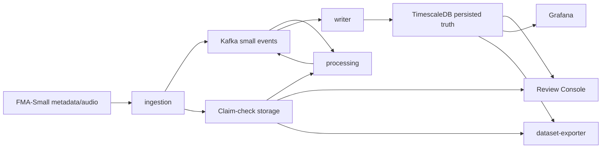
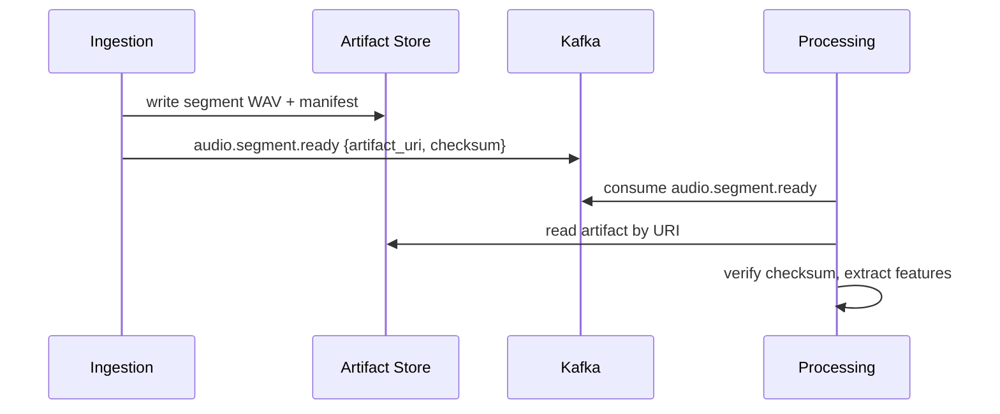
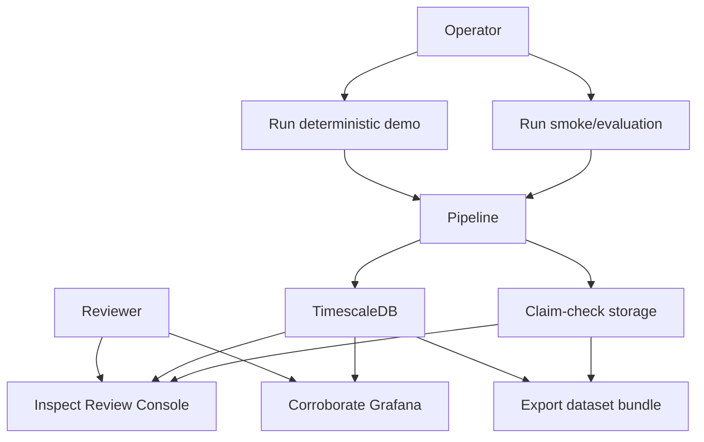
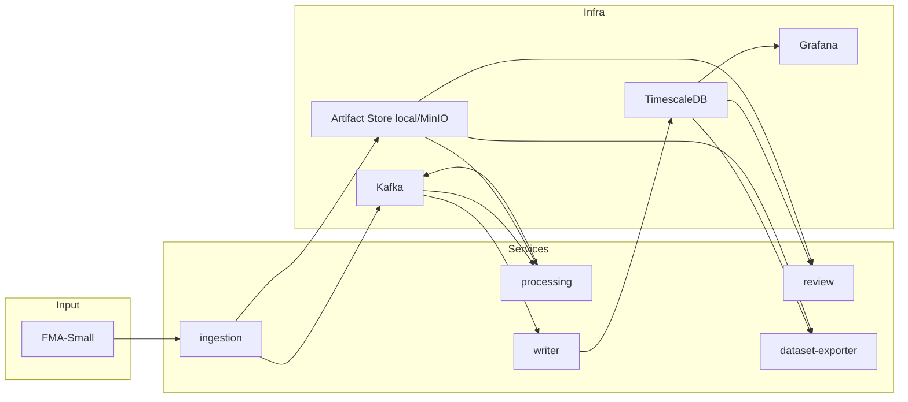
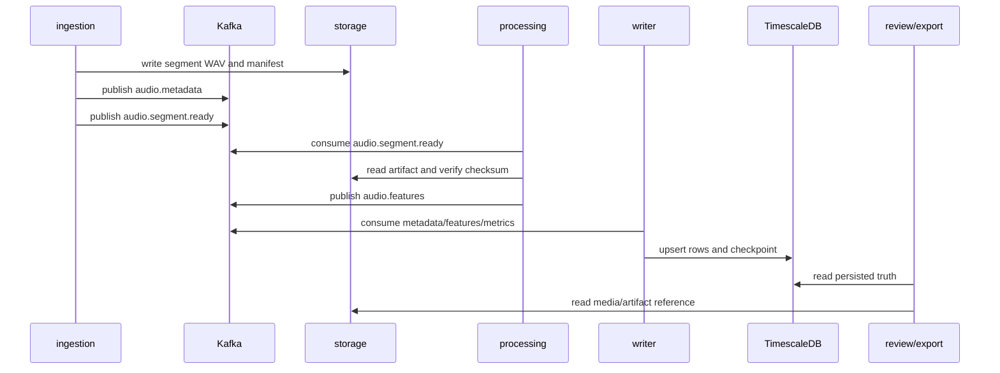
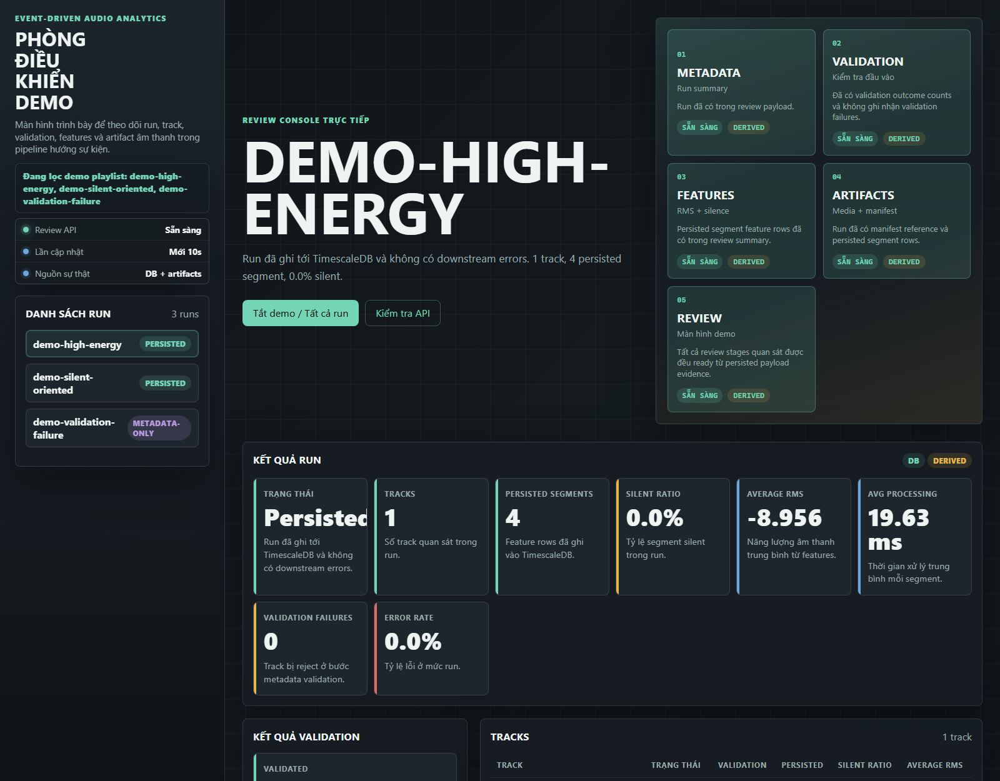
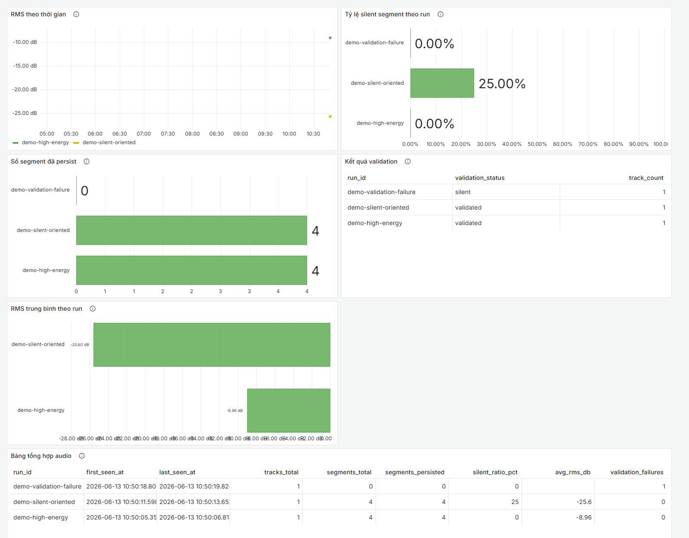
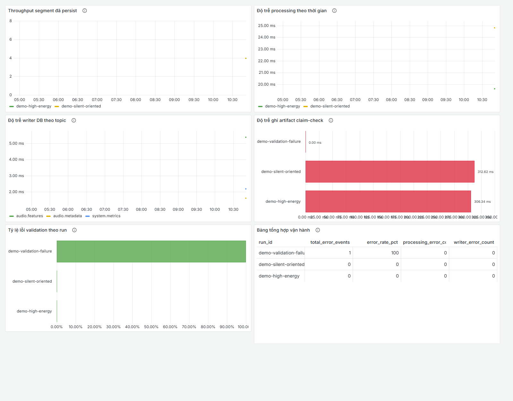

# Báo Cáo Đề Tài: Event-Driven Audio Analytics

Đề tài: **Nghiên cứu kiến trúc Event-Driven Microservices và xây dựng hệ thống phân tích dữ liệu lớn âm thanh thời gian thực trên nền tảng Private Cloud**

> Bản thảo Markdown. Bản này là source of truth để review nội dung trước khi xuất Word/PDF.

## Thông Tin Bằng Chứng

| Thuộc tính | Giá trị |
|---|---|
| Evidence snapshot | `docs/report-assets/evidence-20260613-110206/` |
| Evidence manifest | `docs/report-assets/evidence-20260613-110206/evidence-manifest.json` |
| Git commit | `0dc003c1a633c7e5d8b0bfd4fd15e125feeff5f5` |
| Docker | Docker `29.1.3`, Docker Compose `v5.0.0-desktop.1` |
| Host | Windows 11 Pro, 64-bit, SE Asia Standard Time |
| Git status clean | `false` vì evidence/runtime artifact được regenerate và snapshot report được thêm sau khi chạy |
| Test status | `323 passed, 5 skipped` |
| K3s validation level | Manifest-level only, chưa có live cluster apply |

Manifest là bắt buộc để chống stale evidence. Manifest ghi `generated_at`, commit, branch, Docker image IDs, script commands, input profile, run IDs, storage backend, K3s validation level, danh sách file evidence và SHA-256 checksum.

## Tóm Tắt

Dự án `event-driven-audio-analytics` là prototype nghiên cứu có kiểm soát cho bài toán phân tích âm thanh FMA-Small gần thời gian thực bằng kiến trúc Event-Driven Microservices. Hệ thống không xây một nền tảng production-scale. Phạm vi của đề tài là chứng minh pipeline âm thanh có trạng thái, có event contract, có claim-check artifact boundary, có persisted truth trong TimescaleDB, có bề mặt review và observability, có bằng chứng restart/replay không tạo duplicate row trong phạm vi cục bộ.

Pipeline chính gồm `ingestion -> processing -> writer -> review/Grafana -> dataset-exporter`. Kafka chỉ vận chuyển event nhỏ. Audio segment WAV và manifest được đặt ở claim-check storage local hoặc MinIO/S3-compatible. Writer là service biến event thành persisted truth trong TimescaleDB. Review Console là front door đọc-only. Grafana chỉ là lớp corroboration trên cùng dữ liệu đã persist. Dataset exporter tạo bundle từ dữ liệu đã ghi nhận, không tự diễn giải lại Kafka.

Kết quả thực nghiệm ngày 13/06/2026 cho thấy: pytest containerized pass `323 passed, 5 skipped`; demo deterministic tạo được ba run `demo-high-energy`, `demo-silent-oriented`, `demo-validation-failure`; MinIO smoke pass với `3` feature artifact và manifest `s3://fma-small-artifacts/runs/minio-smoke/manifests/segments.parquet`; restart/replay giữ `feature_count=3`, `metadata_count=2`; evaluation bounded local pass với scenario `fma-small-burst-100` đạt `1933` segment, `913.699` segments/minute, writer `2790.256` records/minute. Các số này là bằng chứng cục bộ, không phải benchmark production.

## Danh Mục Từ Viết Tắt

| Từ | Nghĩa |
|---|---|
| EDA | Event-Driven Architecture |
| FMA | Free Music Archive |
| HA/DR | High Availability / Disaster Recovery |
| KRaft | Kafka Raft metadata mode |
| MLOps | Machine Learning Operations |
| PVC | Persistent Volume Claim |
| RMS | Root Mean Square |
| STFT | Short-Time Fourier Transform |
| URI | Uniform Resource Identifier |

## Mục Lục

1. [Chương 1. Tổng quan bài toán, công nghệ và nền tảng thuật toán](#chương-1-tổng-quan-bài-toán-công-nghệ-và-nền-tảng-thuật-toán)
2. [Chương 2. Phân tích, thiết kế và hiện thực hệ thống](#chương-2-phân-tích-thiết-kế-và-hiện-thực-hệ-thống)
3. [Chương 3. Thử nghiệm, đánh giá và kết luận](#chương-3-thử-nghiệm-đánh-giá-và-kết-luận)
4. [Tài liệu tham khảo](#tài-liệu-tham-khảo)
5. [Phụ lục](#phụ-lục)

# Chương 1. Tổng Quan Bài Toán, Công Nghệ Và Nền Tảng Thuật Toán

## 1.1. Đặt Vấn Đề

Phân tích âm thanh gần thời gian thực khác một hệ CRUD thông thường. File âm thanh là payload nhị phân lớn, phải decode, resample, chuyển mono, chia segment, kiểm tra chất lượng, trích xuất đặc trưng rồi mới có dữ liệu phân tích. Nếu đẩy toàn bộ waveform hoặc tensor vào message broker, hệ thống dễ trộn control plane với data plane và làm Kafka thành nơi vận chuyển blob lớn.

Đề tài này tiếp cận theo hướng bounded research system. Hệ thống chỉ dùng FMA-Small, vận chuyển event nhỏ bằng Kafka, vận chuyển audio artifact bằng claim-check URI, ghi kết quả vào TimescaleDB và dùng Review Console/Grafana/dataset bundle làm bằng chứng.

## 1.2. Mục Tiêu Và Ý Nghĩa

Mục tiêu chính:

- Xây dựng pipeline audio analytics gần thời gian thực theo kiến trúc Event-Driven Microservices.
- Chứng minh cách tách payload âm thanh lớn khỏi Kafka bằng Claim-Check Pattern.
- Thiết kế event schema v1, checkpoint và idempotent writer để hỗ trợ replay/restart.
- Dùng TimescaleDB làm persisted truth cho review, dashboard và export.
- Minh họa private-cloud-style deployment bằng K3s một node có giới hạn.

Ý nghĩa kỹ thuật nằm ở chỗ hệ thống cho thấy cách biến một bài toán âm thanh thành pipeline có contract, artifact, evidence và giới hạn rõ ràng, thay vì chỉ upload file rồi vẽ dashboard.

## 1.3. Phạm Vi Và Giới Hạn Nghiên Cứu

| Trong phạm vi | Ngoài phạm vi |
|---|---|
| FMA-Small only | Dataset khác ngoài FMA-Small |
| Docker Compose local runtime | Production cloud fully managed |
| K3s một node, bounded mapping | HA/DR, autoscaling, service mesh |
| Feature extraction summary | Model AI phân loại âm thanh |
| Kafka small-event transport | Big data Kafka benchmark đa broker |
| Local/MinIO claim-check | IAM hardening đầy đủ |
| Restart/replay smoke | Exactly-once end-to-end production claim |

Cách gọi đúng: “gần thời gian thực”, “prototype có kiểm soát”, “bounded research system”, “private-cloud-style deployment”, “bằng chứng thực nghiệm cục bộ”. Tránh gọi là “real-time production”, “big data benchmark”, “production-ready” hoặc “AI model phân loại âm thanh”.

### Định Nghĩa Near-Real-Time Trong Phạm Vi Đề Tài

Trong báo cáo này, “gần thời gian thực” không có nghĩa là hệ thống điều khiển thời gian thực có deadline cứng. Nghĩa đúng là: khi ingestion tạo xong một segment và publish `audio.segment.ready`, processing sẽ xử lý bất đồng bộ theo event, writer sẽ persist kết quả sau khi event được consume, và Review Console/Grafana/export chỉ đọc dữ liệu đã ghi nhận. Hệ thống không cam kết SLA latency production, không có cơ chế scheduler real-time, và không chứng minh worst-case deadline.

## 1.4. Đặc Thù Dữ Liệu Âm Thanh

Âm thanh có các đặc điểm khiến pipeline phức tạp hơn CRUD:

- Payload nhị phân lớn, không phù hợp đặt trực tiếp trong Kafka event.
- Cần decode và chuẩn hóa sample rate trước khi phân tích.
- Cần segmentation để xử lý theo cửa sổ thời gian.
- Cần checksum để chứng minh artifact đọc lại đúng bytes đã ghi.
- Cần traceability theo `run_id`, `track_id`, `segment_idx`.
- Cần reproducibility để có thể replay cùng run mà không nhân đôi dữ liệu.

## 1.5. Dataset FMA-Small

FMA là bộ dữ liệu âm nhạc mở phục vụ music analysis. Phạm vi repo chỉ dùng FMA-Small, thường được mô tả gồm `8000` track, mỗi track `30` giây, cân bằng trên `8` genre [5]. Repo không mở rộng sang FMA Medium/Large hoặc dataset khác.

Trong runtime, dữ liệu local đặt theo cấu trúc:

```text
data/local/fma_metadata/tracks.csv
data/local/fma_small/<prefix>/<track_id>.mp3
```

Demo deterministic dùng fixtures nhỏ trong repo để bảo đảm chạy ổn định và có bằng chứng lặp lại.

Boundary dữ liệu cũng cần viết rõ. FMA có metadata và audio Creative-Commons/licensed theo nghệ sĩ [5], nhưng báo cáo không đính kèm raw audio và không copy dataset lớn vào evidence. Evidence chỉ giữ metadata tóm tắt, screenshot, JSON summary, manifest, checksum và các artifact demo nhỏ cần thiết để chứng minh pipeline. Cách làm này tránh biến phụ lục báo cáo thành nơi phân phối lại dữ liệu âm thanh.

## 1.6. Bài Toán Cần Giải Quyết

Bài toán không phải chỉ lưu file âm thanh. Hệ thống cần:

- Nhận metadata/audio FMA-Small.
- Validate audio path, duration, decode readiness.
- Segment audio thành cửa sổ `3.0s`, overlap `1.5s`.
- Ghi segment WAV/manifest vào artifact store.
- Publish event nhỏ lên Kafka.
- Processing đọc artifact, verify checksum, trích xuất RMS/silence/log-mel shape summary.
- Writer ghi TimescaleDB idempotent và checkpoint.
- Review/Grafana/export cùng đọc persisted truth.

## 1.7. Phương Hướng Tiếp Cận

Hệ thống dùng event-driven pipeline để tách các service:



## 1.8. Event-Driven Microservices

Event-Driven Microservices phù hợp vì ingestion không cần gọi processing đồng bộ, processing không cần biết schema database, và writer là boundary duy nhất biến event thành persisted truth. Kafka topic giữ log sự kiện. Consumer group dùng offset để theo dõi vị trí đọc trong log [6], [7].

Trong repo, topic chính:

| Topic | Producer | Consumer | Nội dung |
|---|---|---|---|
| `audio.metadata` | ingestion | writer | Metadata track, validation status, duration |
| `audio.segment.ready` | ingestion | processing | Claim-check reference cho segment |
| `audio.features` | processing | writer | RMS, silence flag, mel shape, processing time |
| `system.metrics` | ingestion/processing/writer | writer | Metric vận hành |
| `audio.dlq` | reserved | reserved | Chưa là runtime path đầy đủ |

Delivery semantics là phần nền tảng để hiểu vì sao writer cần idempotency. Kafka phân biệt ba mức bảo đảm chính [6]:

| Semantics | Ý nghĩa | Hệ quả khi consumer crash |
|---|---|---|
| At-most-once | Có thể mất message, không redeliver | Nếu commit offset trước khi xử lý, crash có thể làm mất event |
| At-least-once | Không mất message, có thể redeliver | Nếu xử lý xong nhưng crash trước commit offset, event có thể được xử lý lại |
| Exactly-once | Mỗi message được xử lý đúng một lần trong phạm vi có transaction phù hợp | Cần phối hợp producer/consumer/offset/output store phức tạp hơn |

Đề tài chọn cách thực dụng: at-least-once consumption cộng idempotent persistence. Writer chỉ commit Kafka offset sau khi persist và checkpoint thành công. Nếu replay xảy ra, logical key làm cho cùng `run_id`, `track_id`, `segment_idx` được update/upsert thay vì insert duplicate. Báo cáo không claim exactly-once end-to-end vì output store là TimescaleDB và hệ thống không triển khai transaction Kafka end-to-end.

## 1.9. Claim-Check Pattern

Claim-check tách control plane và data plane. Enterprise Integration Patterns mô tả ý tưởng cốt lõi là lưu dữ liệu lớn ở persistent store và truyền một “claim check” để component sau lấy lại dữ liệu đó [16]:

- Control plane: Kafka event nhỏ chứa URI, checksum, sample rate, duration, run ID.
- Data plane: segment WAV và manifest nằm ở local artifact store hoặc MinIO.



Với âm thanh, pattern này không phải over-engineering. Waveform PCM, MP3 đã decode, segment WAV hoặc log-mel tensor đều lớn hơn nhiều so với metadata điều phối. Nếu đặt chúng vào Kafka, broker sẽ vừa làm event log vừa làm blob transport, gây khó kiểm soát throughput, retention, debug và replay. Repo vì vậy chỉ đưa `artifact_uri`, `checksum`, `sample_rate`, `duration_s`, `run_id`, `track_id`, `segment_idx` vào event; bytes thật nằm trong filesystem/MinIO và luôn được kiểm tra checksum trước khi xử lý.

## 1.10. TimescaleDB Và Persisted Truth

TimescaleDB dùng hypertable partition theo thời gian thành chunk [8]. Repo dùng TimescaleDB không chỉ như database mà là nguồn sự thật đã ghi nhận:

- `track_metadata`
- `audio_features`
- `system_metrics`
- `run_checkpoints`
- `welford_snapshots`

Review Console, Grafana và dataset-exporter không đọc trực tiếp Kafka. Chúng đọc TimescaleDB để tránh mỗi bề mặt tự diễn giải kết quả khác nhau.

## 1.11. MinIO Và Object Storage

MinIO là object store S3-compatible [9]. Repo dùng MinIO như biến thể claim-check private-cloud-style. URI mẫu:

```text
s3://fma-small-artifacts/runs/<run_id>/segments/<track_id>/<segment_idx>.wav
s3://fma-small-artifacts/runs/<run_id>/manifests/segments.parquet
```

Một invariant quan trọng: không trộn local backend và MinIO backend trong cùng một persisted run.

## 1.12. Docker Compose Và K3s

Docker Compose là runtime chính để chạy local/dev [10]. K3s là Kubernetes distribution nhẹ, package các thành phần cần thiết cho cluster [11]. Repo chỉ claim K3s một node có giới hạn:

- Kafka KRaft single broker.
- TimescaleDB, MinIO, Grafana single replica.
- Processing/writer/review là Deployment.
- Ingestion/export là Job.
- Không Ingress/TLS/service mesh/GitOps/Terraform/autoscaling/HA/DR.

Trong lần evidence này, K3s chỉ có manifest-level validation. Không có live cluster apply.

## 1.13. Cơ Sở Xử Lý Tín Hiệu Âm Thanh

Pipeline chuẩn hóa audio về mono `32 kHz`, segment `3.0s`, overlap `1.5s`. Processing tính RMS, silence flag, log-mel shape summary. Torchaudio `MelSpectrogram` là composition của `Spectrogram` và `MelScale`, với các tham số như `sample_rate`, `n_fft`, `hop_length`, `n_mels`, `f_min`, `f_max` [12].

Tham số repo:

| Tham số | Giá trị |
|---|---|
| `TARGET_SAMPLE_RATE_HZ` | `32000` |
| `SEGMENT_DURATION_S` | `3.0` |
| `SEGMENT_OVERLAP_S` | `1.5` |
| `N_MELS` | `128` |
| `N_FFT` | `1024` |
| `HOP_LENGTH` | `320` |
| `F_MIN` | `0` |
| `F_MAX` | `16000` |
| `TARGET_FRAMES` | `300` |
| `SILENCE_THRESHOLD_DB` | `-60.0` |

Các công thức nền tảng dùng trong phạm vi báo cáo:

| Thành phần | Công thức/diễn giải |
|---|---|
| Segmentation | Với segment duration `D=3.0s`, overlap `O=1.5s`, bước nhảy `S=D-O=1.5s`. Segment thứ `i` lấy mẫu từ `i*S` đến `i*S+D`. |
| RMS | Với tín hiệu rời rạc `x[n]`, `RMS = sqrt((1/N) * sum(x[n]^2))`. RMS càng thấp thì năng lượng segment càng nhỏ. |
| dBFS | `dBFS = 20 * log10(max(RMS, epsilon))`, trong đó `epsilon` tránh `log(0)`. Silence gating so sánh dBFS với ngưỡng `-60 dB`. |
| STFT | `X(m,k) = sum_n x[n] * w[n-mH] * exp(-j 2*pi*k*n/N)`, với `N=n_fft`, `H=hop_length`, `w` là window. |
| Mel Spectrogram | `M(m,b) = sum_k |X(m,k)|^2 * F_b(k)`, trong đó `F_b` là filterbank Mel. Torchaudio triển khai MelSpectrogram như composition của Spectrogram và MelScale [12]. |
| Log-Mel | `LogMel(m,b) = log(max(M(m,b), epsilon))` hoặc log compression tương đương để giảm dynamic range. |
| Welford | Với metric stream, mỗi giá trị mới cập nhật `count`, `mean`, `M2` online để tính trung bình/phương sai mà không cần giữ toàn bộ mẫu. |

Giới hạn: pipeline không persist full log-mel tensor và không chạy model inference.

# Chương 2. Phân Tích, Thiết Kế Và Hiện Thực Hệ Thống

## 2.1. Mô Tả Hệ Thống

Hệ thống nhận dữ liệu FMA-Small, chia nhỏ audio thành segment, publish event qua Kafka, trích xuất feature summary, ghi TimescaleDB, rồi cung cấp review/dashboard/export. Thành phần chính đã được repo mô tả trong README và system overview [1], [2].

## 2.2. Tác Nhân Hệ Thống

| Tác nhân | Vai trò |
|---|---|
| Operator | Chạy demo, kiểm thử, export dataset |
| Reviewer/Giảng viên | Xem Review Console, Grafana, evidence |
| Ingestion service | Đọc metadata/audio, validate, segment, publish event |
| Processing service | Consume segment event, đọc artifact, extract feature |
| Writer service | Persist event vào TimescaleDB, checkpoint |
| Dataset exporter | Xuất dataset/analytics bundle |

## 2.3. Use Case Tổng Quát



Bảng use case tổng quát:

| Mã | Tên use case | Actor | Tiền điều kiện | Luồng chính | Kết quả |
|---|---|---|---|---|---|
| UC-01 | Khởi động stack | Operator | Docker Desktop hoạt động, repo có config mặc định | Chạy Compose stack, chờ Kafka/TimescaleDB/Grafana/Review sẵn sàng | Runtime local sẵn sàng cho demo |
| UC-02 | Ingest demo/FMA | Operator, ingestion | Có metadata/audio hoặc fixture demo | Ingestion validate track, chuẩn hóa audio, ghi artifact, publish metadata/segment events | Có event nhỏ trên Kafka và artifact trong storage |
| UC-03 | Xử lý segment | processing | Có `audio.segment.ready` và artifact URI hợp lệ | Consume event, đọc artifact, verify checksum, tính RMS/silence/log-mel shape | Có `audio.features` và metric processing |
| UC-04 | Persist kết quả | writer | Kafka có metadata/features/metrics | Validate envelope, upsert DB, ghi checkpoint, commit offset | TimescaleDB có persisted truth |
| UC-05 | Review run | Reviewer | Run đã persist | Mở Review Console, xem run/track/segment/media | Có bằng chứng UI/API đọc từ DB và artifact |
| UC-06 | Đối chiếu Grafana | Reviewer | TimescaleDB có metrics/views | Mở dashboard Audio Quality/System Health | Có corroboration observability, không thay source of truth |
| UC-07 | Export dataset | Operator | Run đã persist đủ metadata/features | Chạy dataset-exporter theo `run_id` | Có bundle manifest, CSV, Parquet, stats, dataset card |
| UC-08 | Restart/replay | Operator | Có cùng `run_id` và event có thể replay | Restart service/replay smoke, kiểm tra row count | Logical feature rows không duplicate |
| UC-09 | K3s manifest validation | Operator | Có `kubectl` client và manifests | Render `deploy/k3s`, nếu có cluster thì dry-run/apply | Evidence ghi rõ manifest-level hay live K3s |

## 2.4. Yêu Cầu Chức Năng

| Mã | Yêu cầu | Ưu tiên | Cách kiểm chứng |
|---|---|---|---|
| F1 | Đọc metadata/audio FMA-Small và validate track | Must | Demo deterministic, metadata rows |
| F2 | Segment audio theo `3.0s`, overlap `1.5s` | Must | Segment artifact count, manifest rows |
| F3 | Ghi artifact vào local hoặc MinIO claim-check storage | Must | Local evidence, MinIO smoke |
| F4 | Publish event `audio.metadata`, `audio.segment.ready`, `system.metrics` | Must | Contract fixtures, Kafka smoke |
| F5 | Processing consume segment event, verify checksum, extract summary | Must | `audio.features` rows, processing metrics |
| F6 | Writer persist metadata/features/metrics/checkpoint vào TimescaleDB | Must | SQL/view evidence, checkpoint rows |
| F7 | Review Console hiển thị run/track/segment/media read-only | Should | Screenshot, Review API JSON |
| F8 | Grafana đọc TimescaleDB để corroborate audio/system health | Should | Dashboard screenshot |
| F9 | Dataset exporter tạo bundle có manifest, splits, stats, dataset card | Should | Export verifier |
| F10 | Restart/replay cùng run không tạo duplicate logical rows | Must | Restart/replay summary |

## 2.5. Yêu Cầu Phi Chức Năng

| Mã | Yêu cầu | Ưu tiên | Cách kiểm chứng |
|---|---|---|---|
| NF1 | Kafka chỉ vận chuyển event nhỏ, không chứa waveform/tensor | Must | Schema payload, event sample |
| NF2 | Artifact URI phải có checksum và namespace theo `run_id` | Must | Manifest sample, checksum pass |
| NF3 | Writer commit offset chỉ sau khi persist và checkpoint | Must | Writer tests, restart/replay |
| NF4 | Review/Grafana/export phải đọc persisted truth | Must | View/API/dashboard/export evidence |
| NF5 | Evidence phải có manifest provenance và checksum | Must | `evidence-manifest.json` |
| NF6 | K3s claim phải phân biệt live apply với manifest-level validation | Must | `k3s-validation-summary.json` |
| NF7 | Không overclaim HA/DR, TLS/IAM, autoscaling production | Must | Scope/limitation section |

## 2.6. Kiến Trúc Tổng Thể



## 2.7. Control Plane Và Data Plane

Control plane gồm Kafka event và schema. Data plane gồm audio artifact và manifest. Tách hai plane giúp:

- Kafka không chịu payload lớn.
- Processing có thể đọc lại artifact theo URI.
- Dataset-exporter có thể giữ reference thay vì copy tensor/audio lớn.
- MinIO variant có thể thay local storage mà event contract vẫn giữ hướng tương tự.

## 2.8. Thiết Kế Luồng Dữ Liệu



## 2.9. Ingestion Service

Ingestion là boundary đầu vào của pipeline. Service này đọc `IngestionSettings` từ env runtime. Mặc định:

- `METADATA_CSV_PATH=data/local/fma_metadata/tracks.csv`
- `AUDIO_ROOT_PATH=data/local/fma_small`
- `FMA_SUBSET=small`
- `TARGET_SAMPLE_RATE_HZ=32000`
- `SEGMENT_DURATION_S=3.0`
- `SEGMENT_OVERLAP_S=1.5`

Thiết kế chi tiết:

| Khía cạnh | Nội dung |
|---|---|
| Trách nhiệm | Đọc metadata/audio, validate, decode/resample/mono, chia segment, ghi artifact/manifest, publish event |
| Input | `tracks.csv`, file MP3 FMA-Small hoặc fixture demo, env settings |
| Output | `audio.metadata`, `audio.segment.ready`, `system.metrics`, segment WAV, manifest |
| Module nội bộ | `metadata_loader.py`, `audio_validation.py`, `segmenter.py`, `artifact_writer.py`, `publisher.py`, `metrics.py`, `runtime.py` |
| Lỗi chính | Thiếu metadata/audio, decode fail, duration không hợp lệ, artifact write fail, Kafka publish fail |
| Evidence | Metadata rows, segment count, artifact tree, manifest checksum, ingestion logs/metrics |

Luồng lỗi quan trọng: track không hợp lệ vẫn phải được ghi nhận bằng `audio.metadata` với `validation_status` tương ứng, còn segment-ready chỉ phát cho track có audio hợp lệ. Nhờ vậy Review Console và dataset-exporter có thể thấy cả accepted và rejected tracks.

## 2.10. Processing Service

Processing consume `audio.segment.ready`, đọc artifact qua URI, verify checksum, tính `rms`, `silent_flag`, `mel_bins`, `mel_frames`, `processing_ms`. Pipeline lưu scalar summary và shape summary. Full tensor không persist.

| Khía cạnh | Nội dung |
|---|---|
| Trách nhiệm | Biến segment artifact thành feature summary |
| Input | Kafka event `audio.segment.ready`, WAV artifact, checksum |
| Output | `audio.features`, `system.metrics` |
| Module nội bộ | `artifact_loader.py`, `rms.py`, `silence.py`, `log_mel.py`, `welford.py`, `metrics.py`, `publisher.py`, `runtime.py` |
| Lỗi chính | `artifact_not_ready`, `checksum_mismatch`, `artifact_load_failed`, `processing_failed`, `feature_publish_failed`, `metric_publish_failed`, `offset_commit_failed` |
| Evidence | `audio_features` rows, processing p95 latency, silence ratio, checksum pass/fail path |

Các lỗi được phân loại để demo/replay không bị mơ hồ. Ví dụ, `artifact_not_ready` là lỗi retryable khi artifact chưa xuất hiện; `checksum_mismatch` là lỗi toàn vẹn dữ liệu; `feature_publish_failed` là lỗi sau xử lý nhưng trước khi event feature đi ra Kafka. Trong phạm vi hiện tại, DLQ topic đã reserved nhưng chưa là failure path runtime đầy đủ.

## 2.11. Writer Service

Writer là boundary biến event thành persisted truth. Service consume `audio.metadata`, `audio.features`, `system.metrics`, validate envelope v1, coerce payload model, persist trong transaction, persist checkpoint rồi mới commit Kafka offset.

| Khía cạnh | Nội dung |
|---|---|
| Trách nhiệm | Ghi metadata/features/metrics/checkpoint vào TimescaleDB một cách idempotent |
| Input | Kafka topics `audio.metadata`, `audio.features`, `system.metrics` |
| Output | Rows trong `track_metadata`, `audio_features`, `system_metrics`, `run_checkpoints`, `welford_snapshots` |
| Module nội bộ | `consumer.py`, `persistence.py`, `upsert_metadata.py`, `upsert_features.py`, `write_metrics.py`, `checkpoint_store.py`, `offset_manager.py`, `metrics.py`, `runtime.py` |
| Lỗi chính | Envelope invalid, payload coercion failed, DB write failed, checkpoint failed, offset commit failed |
| Evidence | DB row count, checkpoint offsets, restart/replay summary, writer write p95 |

Với `audio_features`, logical idempotency key là `(run_id, track_id, segment_idx)`. Vì bảng là Timescale hypertable partition theo `ts`, khóa vật lý của schema có thêm time column. Do đó writer không dựa vào một primary key vật lý chỉ gồm ba trường trên; writer dùng advisory lock theo logical key, `UPDATE` row đã có trước, rồi `INSERT` nếu chưa có. Cách diễn đạt này tránh nhầm lẫn giữa khóa logic phục vụ replay và ràng buộc vật lý của hypertable.

## 2.12. Review Console

Review Console là FastAPI + static UI read-only. API chính:

- `GET /healthz`
- `GET /api/runs`
- `GET /api/runs/{run_id}`
- `GET /api/runs/{run_id}/tracks`
- `GET /api/runs/{run_id}/tracks/{track_id}`
- `GET /media/runs/{run_id}/segments/{track_id}/{segment_idx}.wav`

Review đọc các view như `vw_review_tracks` và artifact storage để hiển thị media.

## 2.13. Grafana Dashboard

Grafana đọc TimescaleDB view, không đọc Kafka. Dashboard chính:

- Audio Quality
- System Health
- Pipeline Operations
- Deterministic Demo Comparison

Vai trò của Grafana là corroboration. Không dùng Grafana làm front door hoặc nguồn truth.

## 2.14. Dataset Exporter

Dataset exporter tạo:

```text
dataset-build-manifest.json
run-summary.json
quality-verdict.json
accepted-tracks.csv
rejected-tracks.csv
accepted-segments.csv
rejected-segments.csv
anomaly-summary.json
label-map.json
splits/train.parquet
splits/validation.parquet
splits/test.parquet
stats/normalization-stats.json
dataset-card.md
```

Split Parquet chứa metadata, label, artifact URI và scalar summary, không chứa log-mel tensor.

## 2.15. Event Schema v1

Envelope bắt buộc:

| Field | Ý nghĩa |
|---|---|
| `event_id` | ID event |
| `event_type` | Loại event |
| `event_version` | `v1` |
| `trace_id` | Trace theo run/service/track |
| `run_id` | Run namespace |
| `produced_at` | Timestamp phát event |
| `source_service` | Service phát event |
| `idempotency_key` | Khóa idempotency |
| `payload` | Payload theo từng event |

Schema nằm trong `schemas/` [13].

Payload `audio.metadata`:

| Field | Bắt buộc | Ý nghĩa |
|---|---|---|
| `run_id` | Có | Namespace run |
| `track_id` | Có | Track FMA |
| `artist_id` | Có | Artist id từ metadata |
| `genre` | Có | Genre được dùng trong scope FMA-Small |
| `source_audio_uri` | Có | URI/path audio nguồn |
| `validation_status` | Có | Trạng thái validate track |
| `duration_s` | Có | Duration audio |
| `subset` | Không | `small` nếu có |
| `manifest_uri` | Không | Manifest liên quan |
| `checksum` | Không | Checksum artifact/source nếu có |

Payload `audio.segment.ready`:

| Field | Bắt buộc | Ý nghĩa |
|---|---|---|
| `run_id` | Có | Namespace run |
| `track_id` | Có | Track chứa segment |
| `segment_idx` | Có | Thứ tự segment trong track |
| `artifact_uri` | Có | Claim-check URI của WAV segment |
| `checksum` | Có | Checksum để processing verify bytes |
| `sample_rate` | Có | Sample rate sau chuẩn hóa |
| `duration_s` | Có | Duration segment |
| `is_last_segment` | Có | Đánh dấu segment cuối của track |
| `manifest_uri` | Không | Manifest chứa danh sách segment |

Payload `audio.features`:

| Field | Bắt buộc | Ý nghĩa |
|---|---|---|
| `ts` | Có | Timestamp feature row |
| `run_id` | Có | Namespace run |
| `track_id` | Có | Track chứa segment |
| `segment_idx` | Có | Segment được xử lý |
| `artifact_uri` | Có | URI artifact đã đọc |
| `checksum` | Có | Checksum artifact |
| `rms` | Có | Năng lượng RMS |
| `silent_flag` | Có | Cờ silence theo ngưỡng |
| `mel_bins` | Có | Số Mel bins, hiện `128` |
| `mel_frames` | Có | Số frame log-mel summary |
| `processing_ms` | Có | Thời gian xử lý segment |
| `manifest_uri` | Không | Manifest liên quan |

Payload `system.metrics`:

| Field | Bắt buộc | Ý nghĩa |
|---|---|---|
| `ts` | Có | Timestamp metric |
| `run_id` | Có | Namespace run |
| `service_name` | Có | Service phát metric, phải khớp `source_service` |
| `metric_name` | Có | Tên metric |
| `metric_value` | Có | Giá trị metric |
| `labels_json` | Không | Nhãn bổ sung dạng object |
| `unit` | Không | Đơn vị |

## 2.16. Thiết Kế TimescaleDB

Core SQL nằm trong `infra/sql/` [14].

| Bảng/View | Vai trò |
|---|---|
| `track_metadata` | Metadata, validation status, source URI |
| `audio_features` | Feature theo segment, hypertable theo `ts` |
| `system_metrics` | Metric vận hành, hypertable theo `ts` |
| `run_checkpoints` | Offset checkpoint theo consumer/topic/partition/run |
| `welford_snapshots` | Snapshot online stats |
| `vw_dashboard_run_summary` | Summary cho dashboard |
| `vw_review_tracks` | Track view cho Review Console |

Các cột và khóa chính:

| Bảng | Cột chính | Khóa/ràng buộc | Ý nghĩa |
|---|---|---|---|
| `track_metadata` | `run_id`, `track_id`, `artist_id`, `genre`, `subset`, `source_audio_uri`, `validation_status`, `duration_s`, `manifest_uri`, `checksum`, `created_at` | Primary key `(run_id, track_id)` | Mỗi track trong một run có một row metadata |
| `audio_features` | `ts`, `run_id`, `track_id`, `segment_idx`, `artifact_uri`, `checksum`, `manifest_uri`, `rms`, `silent_flag`, `mel_bins`, `mel_frames`, `processing_ms`, `created_at` | Physical primary key `(ts, run_id, track_id, segment_idx)`, hypertable theo `ts`, index `(run_id, track_id, segment_idx)` | Feature theo segment |
| `system_metrics` | `ts`, `run_id`, `service_name`, `metric_name`, `metric_value`, `labels_json`, `unit`, `created_at` | Hypertable theo `ts` | Metric vận hành |
| `run_checkpoints` | `consumer_group`, `topic_name`, `partition_id`, `run_id`, `last_committed_offset`, `updated_at` | Primary key `(consumer_group, topic_name, partition_id, run_id)` | Checkpoint offset theo consumer/topic/partition/run |
| `welford_snapshots` | `run_id`, `service_name`, `metric_name`, `count`, `mean`, `m2`, `updated_at` | Primary key `(run_id, service_name, metric_name)` | Online statistics snapshot |

Điểm cần viết chính xác: idempotency ở `audio_features` dùng logical key `(run_id, track_id, segment_idx)` dưới advisory lock, sau đó update/insert. Khóa vật lý có `ts` vì TimescaleDB yêu cầu unique constraint trên hypertable phải bao gồm partitioning column [8]. Vì vậy báo cáo gọi `(run_id, track_id, segment_idx)` là logical idempotency key, không gọi là primary key vật lý.

## 2.17. Claim-Check Storage

Local URI và S3 URI đều giữ cùng ý tưởng claim-check:

```text
/artifacts/runs/<run_id>/segments/<track_id>/<segment_idx>.wav
s3://fma-small-artifacts/runs/<run_id>/segments/<track_id>/<segment_idx>.wav
```

Checksum được verify trước khi processing decode. MinIO smoke ngày 13/06/2026 pass với bucket `fma-small-artifacts`, `3` feature artifact, `1` manifest, `3` manifest rows và review media stream `audio/wav`.

## 2.18. Idempotency, Checkpoint Và Replay

Writer persist checkpoint trong `run_checkpoints` bằng `ON CONFLICT ... DO UPDATE`. Kafka offset chỉ commit sau khi persistence và checkpoint thành công. Restart/replay smoke dùng cùng `run_id=replay-smoke`, sau replay vẫn giữ:

| Metric | Giá trị |
|---|---:|
| `metadata_count` | `2` |
| `feature_count` | `3` |
| `processing_ms_count` | `6` |
| `writer_rows_upserted_count` | `30` |
| `writer_write_ms_count` | `30` |

## 2.19. Runtime Config

Runtime config đi qua env vars. Docker Compose là path chính. MinIO có canonical env:

- `STORAGE_BACKEND=minio`
- `MINIO_ENDPOINT_URL=http://minio:9000`
- `MINIO_BUCKET=fma-small-artifacts`
- `MINIO_CREATE_BUCKET=true` khi init bucket trong Compose smoke

K3s dùng ConfigMap/Secret/PVC, nhưng không claim production secret/IAM hardening.

## 2.20. Docker Compose Deployment

Compose stack gồm Kafka, TimescaleDB, MinIO tùy chọn, Grafana, ingestion, processing, writer, review, dataset-exporter và pytest. Compose thích hợp cho local demo vì:

- Dễ chạy lại deterministic evidence.
- Dễ mount artifact/test fixtures.
- Dễ lấy Docker stats cho bounded evaluation.

## 2.21. K3s Private-Cloud Bounded Mapping

K3s manifest nằm trong `deploy/k3s/`. Mapping:

| Compose/Kiến trúc | K3s primitive |
|---|---|
| Kafka | StatefulSet + Service + topic bootstrap Job |
| TimescaleDB | StatefulSet + PVC + SQL init assets |
| MinIO | StatefulSet + PVC + bucket-init Job |
| Grafana | Deployment + Service + provisioned dashboards |
| processing/writer/review | Deployment |
| ingestion/dataset-exporter | one-shot Job |

Evidence lần này:

- `kubectl kustomize deploy/k3s` pass, render `1820` dòng.
- `kubectl apply --dry-run=client --validate=false -k deploy/k3s` không pass vì kubectl vẫn cố server discovery và không có usable cluster API.
- Không claim đã chạy live trên K3s.

## 2.22. Quyết Định Thiết Kế Quan Trọng

| Quyết định | Lý do | Trade-off |
|---|---|---|
| Kafka chỉ event nhỏ | Tránh broker vận chuyển waveform/tensor | Cần artifact store và checksum riêng |
| Claim-check cho artifact | Phù hợp payload âm thanh lớn | Cần xử lý lỗi artifact missing/checksum mismatch |
| Writer là persisted-truth boundary | Tránh review/export tự diễn giải event | Writer trở thành boundary quan trọng cần test kỹ |
| TimescaleDB cho features/metrics/checkpoints | Dữ liệu có timestamp và cần query theo run | Hypertable unique key phải tính đến time column |
| Review Console là front door | Demo audio pipeline cần kiểm tra track/segment/media | UI không thay thế observability vận hành |
| Grafana là corroboration | Observability không thay thế truth | Dashboard phải đọc cùng DB để tránh lệch nghĩa |
| K3s một node bounded | Bảo vệ private-cloud narrative nhưng không overclaim | Chưa chứng minh HA/DR/autoscaling |

## 2.23. Security Boundary

Security trong phạm vi đề tài là baseline cho demo/research, không phải production hardening:

- Không hardcode production secret vào source code hoặc báo cáo.
- Runtime config dùng env vars; K3s mapping dùng ConfigMap/Secret example thay vì claim secret management đầy đủ.
- Evidence manifest ghi image IDs, command và checksum, nhưng không ghi credential.
- Chưa có TLS/Ingress/IAM/NetworkPolicy/service mesh production-grade.
- Nếu triển khai thật, cần bổ sung secret rotation, TLS termination, network policy, bucket policy, DB credential lifecycle và audit logging.

# Chương 3. Thử Nghiệm, Đánh Giá Và Kết Luận

## 3.1. Mục Tiêu Đánh Giá

Đánh giá nhằm trả lời:

- Pipeline có chạy end-to-end không?
- Kafka có giữ small-event boundary không?
- Claim-check local và MinIO có hoạt động không?
- Writer có idempotent khi replay/restart không?
- TimescaleDB có là persisted truth cho review/dashboard/export không?
- Dataset bundle có đầy đủ file và manifest không?
- K3s claim ở mức nào: live apply hay manifest-level?

## 3.2. Môi Trường Thử Nghiệm

Theo manifest [15]:

| Thuộc tính | Giá trị |
|---|---|
| Host OS | Windows 11 Pro |
| Docker | `29.1.3` |
| Docker Compose | `v5.0.0-desktop.1` |
| Evidence timestamp | `2026-06-13T04:04:35Z` |
| Git commit | `0dc003c1a633c7e5d8b0bfd4fd15e125feeff5f5` |
| Dataset scope | FMA-Small only |

## 3.3. Evidence Manifest Chống Stale Evidence

File `evidence-manifest.json` ghi:

- `generated_at`
- `git_commit`, `git_branch`, `git_status_clean`
- `run_ids`
- `storage_backend`
- `docker_version`, `docker_compose_version`
- Docker image tags/IDs
- Host OS
- Script commands và status
- Input data profile
- K3s validation status
- Evidence file paths, byte size, SHA-256

Vì vậy, khi bị hỏi “số này chạy từ bản code nào?”, báo cáo trỏ được tới commit, image IDs, command và checksum.

## 3.4. Kịch Bản Demo Deterministic

Ba run chính:

| Run | Ý nghĩa | Kết quả |
|---|---|---|
| `demo-high-energy` | Track hợp lệ năng lượng cao | `4` segment persisted, error rate `0` |
| `demo-silent-oriented` | Track hợp lệ có segment im lặng | `4` segment persisted, silent ratio `0.25` |
| `demo-validation-failure` | Track fail validation | `0` segment, validation failure `1` |

Review Console:



Ba run này được chọn để phủ ba trạng thái cần bảo vệ khi demo: track hợp lệ có feature, track hợp lệ có silence segment, và track bị reject ở validation. Vì vậy demo không chỉ chứng minh happy path, mà còn chứng minh pipeline có biểu diễn lỗi dữ liệu đầu vào trong persisted truth.

## 3.5. Ma Trận Mục Tiêu - Kiểm Chứng - Evidence

| Mục tiêu | Kiểm chứng | Evidence |
|---|---|---|
| Ingestion đọc/validate audio | Demo deterministic | `review-dashboard-summary.json` |
| Segment audio đúng | Segment count persisted | `review-api.json`, dataset manifests |
| Kafka chỉ event nhỏ | Schema/event contract | `schemas/*.json` |
| Claim-check local hoạt động | Demo local | review media + dataset bundle |
| Claim-check MinIO hoạt động | MinIO smoke | `minio-smoke-summary.json` |
| Processing extract feature | `audio_features` summary | Review/Grafana/evaluation JSON |
| Writer idempotent | Restart/replay smoke | `restart-replay-summary.json` |
| TimescaleDB persisted truth | Review/Grafana/export cùng đọc DB | SQL views + evidence |
| Review Console đọc run | Screenshot/API | `review-console.png`, `review-api.json` |
| Grafana corroboration | Dashboard screenshot | `audio-quality-dashboard.png`, `system-health-dashboard.png` |
| Dataset bundle | Export verifier | `dataset-export-summary.json` |
| Bounded performance | Evaluation script | latency/throughput/resource/scaling JSON |
| K3s bounded private-cloud | Manifest render | `k3s-validation-summary.json` |

Ma trận này là cách đọc Chương 3. Mỗi số liệu hoặc screenshot phải nối được về một mục tiêu kiểm chứng. Nếu một evidence không chứng minh mục tiêu nào, không nên đưa vào phần kết quả chính mà nên để phụ lục.

## 3.6. Grafana Evidence

Audio Quality:



System Health:



Grafana chứng minh hệ thống có lớp observability đọc được dữ liệu đã persist, nhưng Grafana không phải source of truth. Source of truth là TimescaleDB sau khi writer ghi nhận event. Grafana chỉ render query/view trên DB; nếu dashboard refresh chậm, filter sai khoảng thời gian, hoặc panel lỗi, kết luận kỹ thuật vẫn phải quay về Review Console/API, SQL rows và evidence JSON.

## 3.7. Dataset Export Evidence

Dataset export verifier pass cho:

| Run | Quality verdict | Bundle status |
|---|---|---|
| `demo-high-energy` | `pass` | Có đủ required files |
| `demo-silent-oriented` | `pass` | Có đủ required files |
| `demo-validation-failure` | `fail` | Có đủ required files, thể hiện rejected-track case |

Required bundle files gồm `dataset-build-manifest.json`, accepted/rejected CSV, split Parquet, stats và dataset card.

Điểm cần nhấn mạnh: dataset-exporter không đọc trực tiếp Kafka và không tự chạy lại feature extraction. Nó đọc dữ liệu đã persist để tạo bundle. Vì vậy bundle là bằng chứng rằng persisted truth đủ nhất quán để tái sử dụng downstream, không phải bằng chứng rằng model training đã được thực hiện.

## 3.8. MinIO Claim-Check Evidence

MinIO smoke:

| Metric | Giá trị |
|---|---|
| `run_id` | `minio-smoke` |
| `storage_backend` | `minio` |
| Bucket | `fma-small-artifacts` |
| Feature artifacts | `3` |
| Manifest count | `1` |
| Manifest rows | `3` |
| Review media content type | `audio/wav` |

Manifest reference:

```text
s3://fma-small-artifacts/runs/minio-smoke/manifests/segments.parquet
```

## 3.9. Restart/Replay Evidence

Restart/replay smoke dùng run `replay-smoke`. Baseline checkpoint offsets tăng sau replay, nhưng logical persisted feature count vẫn `3`. Điều này chứng minh replay cùng run không tạo duplicate segment feature rows trong phạm vi smoke.

| Topic | Baseline offset | Replay offset |
|---|---:|---:|
| `audio.features` | `2` | `5` |
| `audio.metadata` | `1` | `3` |
| `system.metrics` | `9` | `19` |

Hai nhóm số cần đọc tách biệt. `feature_count=3` là số dòng feature cuối cùng theo logical segment và là bằng chứng chống duplicate row. `writer_rows_upserted_count=30` trong bảng mục 2.18 là metric số lần writer thực hiện/upsert qua các lượt baseline và replay, không phải số dòng feature cuối cùng. Vì vậy không có mâu thuẫn giữa “3 feature rows” và “30 write attempts”.

## 3.10. Evaluation Evidence

Evaluation ngày 13/06/2026:

| Scenario | Status | Tracks accepted | Segments |
|---|---|---:|---:|
| deterministic-review-demo | passed | `1` | `3` |
| fma-small-burst-5 | passed | `5` | `96` |
| fma-small-burst-100 | passed | `100` | `1933` |
| fma-small-scaling-r1 | passed | `5` | `96` |
| fma-small-scaling-r2 | passed | `5` | `96` |
| fma-small-scaling-r3 | passed | `5` | `96` |
| fma-small-full-local-experiment | skipped | `0` | `0` |

Latency summary:

| Scenario | Wall clock ms | DB span ms | Processing p95 ms | Writer p95 ms |
|---|---:|---:|---:|---:|
| deterministic-review-demo | `5879.950` | `1652.819` | `26.861` | `11.260` |
| fma-small-burst-5 | `15886.562` | `6099.108` | `27.690` | `2.671` |
| fma-small-burst-100 | `126934.592` | `110060.470` | `29.554` | `3.581` |

Latency p95 ở processing khoảng `26-30 ms` cho các scenario đã chạy cho thấy feature extraction theo segment không phải bottleneck chính trong phạm vi fixture/local evaluation. Wall clock và DB span tăng theo số track/segment, nên kết luận đúng là pipeline xử lý được burst cục bộ có giới hạn, không phải claim latency production.

Throughput summary:

| Scenario | Tracks/min | Segments/min | Writer records/min |
|---|---:|---:|---:|
| deterministic-review-demo | `20.408` | `30.613` | `153.063` |
| fma-small-burst-5 | `18.884` | `362.571` | `1121.703` |
| fma-small-burst-100 | `47.268` | `913.699` | `2790.256` |

Throughput `913.699` segments/minute ở `fma-small-burst-100` chứng minh pipeline không chỉ chạy vài segment demo. Tuy nhiên đây vẫn là local bounded evidence trên một máy, một broker và một cấu hình topic cụ thể. Không dùng số này như benchmark Kafka hoặc benchmark production.

Scaling evidence:

| Scenario | Processing replicas | Segments/min | Processing p95 ms |
|---|---:|---:|---:|
| fma-small-scaling-r1 | `1` | `394.502` | `26.524` |
| fma-small-scaling-r2 | `2` | `384.232` | `35.874` |
| fma-small-scaling-r3 | `3` | `377.151` | `35.595` |

Verdict của evaluator: `bounded_partition_limited_evidence`. Topic `audio.segment.ready` hiện một partition nên replica scaling bị partition-bound. Khi một topic chỉ có một partition, trong một consumer group chỉ một processing consumer có thể thực sự nhận partition đó tại một thời điểm. Vì vậy replica tăng từ `1` lên `2` hoặc `3` nhưng throughput không tăng là kết quả hợp lý của partition model, không phải bằng chứng rằng processing scale-out thất bại. Muốn đánh giá scale-out đúng nghĩa, cần tăng số partition của `audio.segment.ready`, đảm bảo key/ordering phù hợp, rồi chạy lại cùng scenario.

## 3.11. K3s Validation Evidence

K3s status lần này:

| Check | Kết quả |
|---|---|
| `kubectl version --client` | Có client `v1.34.1` |
| `kubectl kustomize deploy/k3s` | Pass, render `1820` dòng |
| Live cluster access | Không có usable cluster API |
| `kubectl apply --dry-run=client --validate=false -k deploy/k3s` | Not passed do server discovery |
| Claim trong báo cáo | Manifest-level validation only |

Không viết “đã chạy live trên K3s”. Cách viết đúng: “repo cung cấp K3s private-cloud-style mapping và manifest đã render được; lần thử nghiệm này chưa có live K3s cluster apply”.

## 3.12. Đối Chiếu Kết Quả Với Yêu Cầu

| Yêu cầu | Kết quả |
|---|---|
| Pipeline end-to-end | Pass demo deterministic |
| Claim-check local | Pass trong demo |
| Claim-check MinIO | Pass `minio-smoke` |
| TimescaleDB persisted truth | Review/Grafana/export dùng cùng DB |
| Restart/replay | Pass smoke, không duplicate feature count |
| Dataset export | Pass bundle verifier |
| Evaluation | Pass bounded local scenarios |
| K3s private-cloud | Manifest-level validation only |

## 3.13. Ưu Điểm

- Định vị scope rõ, tránh overclaim.
- Kiến trúc thể hiện đúng event-driven decoupling.
- Claim-check phù hợp bài toán audio payload lớn.
- Writer boundary làm persisted truth rõ ràng.
- Có evidence UI, dashboard, JSON, restart/replay, MinIO và evaluation.
- Có manifest chống stale evidence.

## 3.14. Hạn Chế

- Không có HA/DR, autoscaling production, service mesh, TLS/Ingress.
- Kafka single broker và topic partition còn giới hạn.
- K3s chưa chạy live trong lần evidence này.
- Không training model, không model serving, không MLOps đầy đủ.
- Không persist full log-mel tensor.
- Evaluation là bounded local evidence, không phải benchmark production.
- `audio.dlq` reserved nhưng chưa là runtime path đầy đủ.

## 3.15. Hướng Phát Triển

- Chạy live K3s trên cluster thật và ghi evidence apply/Job/port-forward.
- Tăng partition cho `audio.segment.ready` để thử scaling processing hợp lý hơn.
- Hoàn thiện DLQ runtime path.
- Persist hoặc export tensor nếu mục tiêu downstream model training yêu cầu.
- Thêm TLS/Ingress/Secret hardening nếu chuyển sang môi trường vận hành nghiêm túc.
- Bổ sung model inference như một phase riêng, không trộn với báo cáo hiện tại.

## 3.16. Kết Luận

Đề tài đã chứng minh được một prototype nghiên cứu có kiểm soát cho audio analytics gần thời gian thực theo kiến trúc Event-Driven Microservices. Điểm chính không nằm ở claim production hay AI model, mà ở cách tổ chức pipeline âm thanh có event contract, claim-check storage, persisted truth, idempotency/replay và evidence thực nghiệm.

Kết quả phù hợp với phạm vi TTCS nếu trình bày theo trục: bài toán âm thanh -> nền tảng công nghệ/thuật toán -> thiết kế pipeline -> bằng chứng kiểm chứng -> giới hạn. Các giới hạn đã được nêu rõ để tránh nhầm với production data platform.

# Tài Liệu Tham Khảo

[1] Project README, `README.md`.

[2] System Overview, `docs/architecture/system-overview.md`.

[3] Final Demo Runbook, `docs/runbooks/demo.md`.

[4] Validation Runbook, `docs/runbooks/validation.md`.

[5] M. Defferrard et al., “FMA: A Dataset For Music Analysis,” GitHub repository: https://github.com/mdeff/fma.

[6] Apache Kafka Documentation, https://kafka.apache.org/documentation/.

[7] Confluent, “Kafka Consumer Design,” https://docs.confluent.io/kafka/design/consumer-design.html.

[8] TimescaleDB Hypertables Documentation, https://docs.timescale.com/use-timescale/latest/hypertables/.

[9] MinIO Object Store, https://github.com/minio/minio.

[10] Docker Compose Documentation, https://docs.docker.com/compose/.

[11] K3s Documentation, https://docs.k3s.io/.

[12] PyTorch Audio, `torchaudio.transforms.MelSpectrogram`, https://docs.pytorch.org/audio/2.8/generated/torchaudio.transforms.MelSpectrogram.html.

[13] Event schemas, `schemas/`.

[14] TimescaleDB SQL schema and views, `infra/sql/`.

[15] Evidence manifest, `docs/report-assets/evidence-20260613-110206/evidence-manifest.json`.

[16] Enterprise Integration Patterns, “Claim Check,” https://www.enterpriseintegrationpatterns.com/patterns/messaging/StoreInLibrary.html.

# Phụ Lục

## Phụ Lục A. Cấu Trúc Repository

```text
.
|-- artifacts/
|-- data/
|-- deploy/k3s/
|-- docs/
|-- infra/
|-- schemas/
|-- scripts/
|-- services/
|-- src/event_driven_audio_analytics/
|-- tests/
|-- docker-compose.yml
|-- pyproject.toml
|-- run-demo.ps1
`-- run-demo.sh
```

## Phụ Lục B. Lệnh Chạy Demo Và Evidence

```powershell
powershell -ExecutionPolicy Bypass -File .\scripts\smoke\check-pytest.ps1
powershell -ExecutionPolicy Bypass -File .\scripts\demo\generate-demo-evidence.ps1
powershell -ExecutionPolicy Bypass -File .\scripts\evaluation\run-evaluation.ps1
powershell -ExecutionPolicy Bypass -File .\scripts\smoke\check-minio-claim-check-flow.ps1
kubectl kustomize deploy/k3s
kubectl apply --dry-run=client --validate=false -k deploy/k3s
```

## Phụ Lục C. Event Schema Mẫu

```json
{
  "event_id": "...",
  "event_type": "audio.features",
  "event_version": "v1",
  "trace_id": "...",
  "run_id": "...",
  "produced_at": "...",
  "source_service": "processing",
  "idempotency_key": "...",
  "payload": {
    "ts": "...",
    "run_id": "...",
    "track_id": 2,
    "segment_idx": 0,
    "artifact_uri": "...",
    "checksum": "...",
    "rms": -8.9,
    "silent_flag": false,
    "mel_bins": 128,
    "mel_frames": 300,
    "processing_ms": 19.6
  }
}
```

## Phụ Lục D. Checklist Trước Khi Nộp

- [ ] Evidence manifest tồn tại và có checksum.
- [ ] Report dùng số liệu từ manifest mới nhất.
- [ ] Chương 3 không claim K3s live nếu chỉ manifest-level.
- [ ] Không dùng cụm “production-ready”, “benchmark-scale”, “AI classification model” như kết quả đã làm.
- [ ] Tài liệu tham khảo đánh số đúng.
- [ ] Ảnh trong `docs/report-assets/evidence-20260613-110206/` render được.
- [ ] Nếu xuất Word/PDF, kiểm tra lại caption hình/bảng.

## Unresolved Questions

Không có.
